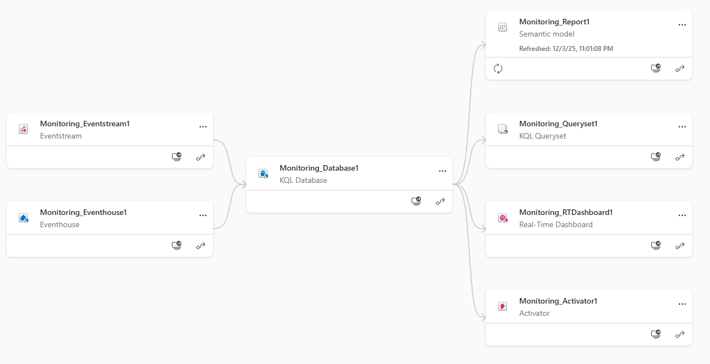

# Fabric Activator Alerts from KQL Querysets

## Prerequisites
- A workspace on **Fabric Capacity (F2-F2048)**
- Workspace monitoring is **enabled** (Monitoring > Log workspace activity)
- Eventhouse with a KQL database that contains monitoring data
- KQL Queryset connected to that KQL database



## Step-by-Step How to Create the alert
1. In your workspace, open Monitoring and enable "Log workspace activity" if it is not already on.
	
2. Open the KQL Queryset connected to your Eventhouse KQL DB.
3. Run the query below to surface mirrored table failures from the past 15 minutes.

```kql
// Failures in table-level mirroring in last 15 minutes
MirroredDatabaseTableExecutionLogs
| where Timestamp > ago(15m)
| where OperationName == "FailTable"
| project Timestamp, ItemName, SourceSchemaName, SourceTableName, Region, ProcessedRows, ProcessedBytes
```

4. Select **Set alert** in the Queryset toolbar and configure:
	- Schedule: how often to run (for example, every 5 minutes).
	- Trigger: when the query returns any rows, or a visualization condition.
	- Actions: send email or Teams notification, or open Activator to add follow-on actions.
5. Save the alert.

## Tips
- The same alerting flow is available from Real-Time Dashboards (set an alert on a tile); this guide focuses on KQL DBs and Querysets.
- Keep the time window tight (for example, 5 to 15 minutes) and project only needed columns to reduce cost and noise.

